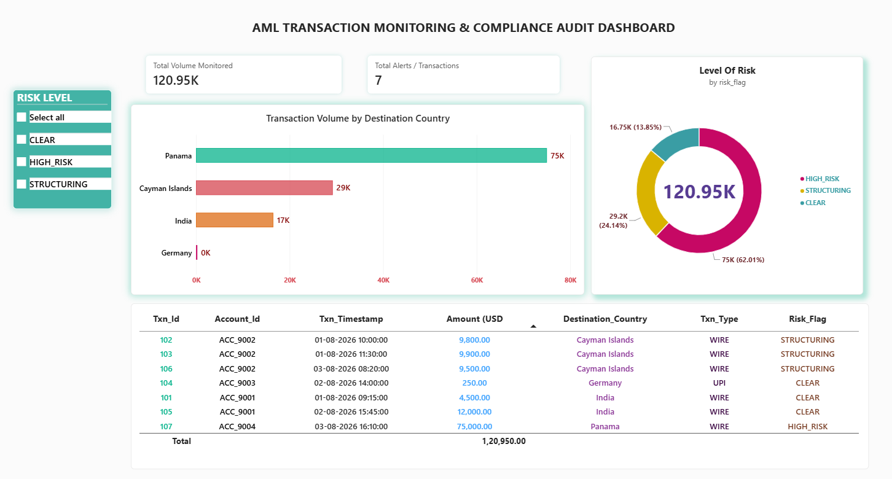

# AML Transaction Monitoring & Compliance Audit Dashboard

A SQL Server and Power BI portfolio project demonstrating rule-based Anti-Money Laundering (AML) transaction monitoring, risk classification, compliance alert generation, and audit-oriented reporting using sample transaction data.

The project translates selected transaction-monitoring scenarios into SQL detection rules and presents the results through an interactive Power BI dashboard.

---

## Project Overview

Financial institutions monitor transactions to identify unusual patterns that may require further investigation. This project demonstrates how SQL-based business rules can be used to identify selected risk indicators, classify transactions, and prepare structured outputs for compliance-oriented reporting.

The monitoring logic was developed using **Microsoft SQL Server and T-SQL**. The SQL Server outputs were then connected to **Microsoft Power BI** to create an interactive risk and compliance dashboard.

This is an educational portfolio project using sample data. It is not intended to represent a complete production banking or regulatory compliance system.

---

## Objectives

- Create a structured transaction-monitoring database using SQL Server.
- Develop SQL rules to identify selected suspicious transaction patterns.
- Classify transactions based on defined risk indicators.
- Create reusable SQL views and stored procedures for monitoring outputs.
- Prepare compliance-oriented alert data for reporting.
- Connect SQL Server outputs to Power BI.
- Build a dashboard to summarize transaction volume, risk categories, and flagged activity.
- Demonstrate how data analysis can support risk, compliance, and management reporting workflows.

---

## Technology Stack

| Category | Tools / Technologies |
|---|---|
| Database | Microsoft SQL Server |
| Query Language | T-SQL |
| Database Tool | SQL Server Management Studio |
| Business Intelligence | Microsoft Power BI |
| Version Control | Git and GitHub |
| Analytical Concepts | Aggregations, CTEs, window functions, conditional logic |
| Reporting Concepts | KPI reporting, risk classification, alert summaries, audit-oriented analysis |

---

## Project Workflow

```text
Sample Transaction Data
          |
          v
SQL Server Database
          |
          v
Transaction Detection Rules
          |
          +-----------------------------+
          |                             |
          v                             v
Structuring Detection       High-Risk Jurisdiction Checks
          |                             |
          +-------------+---------------+
                        |
                        v
             Transaction Velocity Checks
                        |
                        v
             Automated Risk Classification
                        |
                        v
             Compliance Alert View
                        |
                        v
              Power BI Dashboard
                        |
                        v
        Risk and Compliance Reporting
```

---

## Monitoring Rules Implemented

### 1. Transaction Structuring Detection

Transaction structuring refers to the possible division of transactions into smaller amounts to avoid attention or reporting thresholds.

This project uses an illustrative rule to identify repeated transactions within a configured amount range close to the example threshold.

The rule applies:

- Account-level grouping
- Amount filtering
- `GROUP BY`
- `HAVING`
- Transaction-count analysis

> The threshold and amount range used in this project are illustrative project parameters. Actual reporting thresholds and compliance requirements vary by jurisdiction, institution, transaction type, and applicable regulations.

---

### 2. High-Risk Jurisdiction Screening

The project includes a rule to identify selected high-value outbound wire transactions involving configured destination countries in the sample dataset.

The rule applies:

- Destination-country filtering
- Transaction-type filtering
- Amount thresholds
- Conditional risk classification

The countries used in this project are illustrative screening examples. They should not be interpreted as permanent or universal regulatory classifications.

In a production environment, jurisdiction-risk information should be maintained using approved and regularly updated reference data.

---

### 3. Transaction Velocity Monitoring

Transaction velocity monitoring identifies rapid successive transactions that may require additional review.

The project uses:

- Account-level transaction sequencing
- Chronological ordering
- `LAG()`
- `OVER()`
- `PARTITION BY`
- `DATEDIFF()`
- Common Table Expressions

The logic compares consecutive transactions for the same account and identifies short-interval activity based on the configured project rule.

Potential review scenarios may include:

- Unusual rapid transfers
- Sudden transaction bursts
- Possible account takeover
- Unusual movement of funds
- Potential layering patterns

An alert does not automatically confirm financial crime. It indicates that the transaction may require further investigation.

---

## Repository Structure

```text
aml-transaction-monitoring-sql/
│
├── 00_schema_and_data.sql
├── 01_structuring_detection.sql
├── 02_high_risk_jurisdictions.sql
├── 03_automated_risk_classification.sql
├── 04_velocity_risk_detection.sql
├── 05_compliance_alert_view.sql
├── 06_automated_monitoring_procedure.sql
│
├── aml_dashboard_preview.png
├── AML_Compliance_Dashboard.pbix
│
└── README.md
```

### SQL Script Description

| File | Description |
|---|---|
| `00_schema_and_data.sql` | Creates the database objects, transaction table, constraints, and sample transaction records. |
| `01_structuring_detection.sql` | Detects repeated transactions within the configured structuring range. |
| `02_high_risk_jurisdictions.sql` | Identifies selected high-value outbound transactions involving configured destination countries. |
| `03_automated_risk_classification.sql` | Assigns risk flags using rule-based conditional logic. |
| `04_velocity_risk_detection.sql` | Uses window functions and time comparisons to identify rapid transaction activity. |
| `05_compliance_alert_view.sql` | Creates a reusable view for compliance-oriented alert reporting. |
| `06_automated_monitoring_procedure.sql` | Creates a stored procedure for repeatable monitoring and classification execution. |

---

## Risk Classification

The project uses rule-based risk flags to categorize transactions.

| Risk Flag | Meaning |
|---|---|
| `CLEAR` | No configured risk rule was triggered in the sample monitoring logic. |
| `STRUCTURING` | The transaction matched the configured structuring-detection rule. |
| `HIGH_RISK` | The transaction matched the configured high-risk screening rule. |

A `CLEAR` classification does not guarantee that a transaction is risk-free. It only means that none of the implemented project rules were triggered.

A flagged transaction is not automatically proof of illegal activity. It represents a potential alert for review.

---

## SQL Concepts Demonstrated

### Database Creation and Data Handling

- `CREATE DATABASE`
- `CREATE TABLE`
- Primary keys
- Constraints
- `INSERT`
- `UPDATE`

### Analytical Querying

- `SELECT`
- `WHERE`
- `GROUP BY`
- `HAVING`
- `ORDER BY`
- `CASE`
- Common Table Expressions
- Aggregations
- Conditional filtering

### Window Functions

- `LAG()`
- `OVER()`
- `PARTITION BY`
- Chronological transaction analysis

### Database Programming

- `CREATE VIEW`
- `CREATE PROCEDURE`
- Reusable monitoring logic
- Rule-based risk classification

---

## Power BI Dashboard

The SQL Server monitoring outputs were connected to Microsoft Power BI to create an interactive dashboard for risk and compliance reporting.

### Dashboard Features

- Total transaction volume monitored
- Total transactions and alerts
- Risk-level distribution
- Transaction volume by destination country
- Risk-level filtering
- Transaction-level alert details
- Transaction amount analysis
- Account and timestamp information
- Destination country and transaction type
- Risk-flag classification

### Dashboard Preview



### Dashboard Summary

The sample dashboard displays:

- **Total Volume Monitored:** USD 120.95K
- **Total Transactions Displayed:** 7
- **Risk Categories:** `HIGH_RISK`, `STRUCTURING`, and `CLEAR`
- Transaction-level details including account, timestamp, amount, destination country, transaction type, and risk flag

The displayed values are based on the sample transaction data used in this project.

---

## Sample Monitoring Results

The sample validation produced the following illustrative results:

| Risk Flag | Transaction Count | Total Exposure (USD) |
|---|---:|---:|
| `HIGH_RISK` | 1 | 75,000.00 |
| `STRUCTURING` | 3 | 29,200.00 |
| `CLEAR` | 3 | 16,750.00 |
| **Total** | **7** | **120,950.00** |

These figures are generated from sample data and do not represent real customers, accounts, or financial institutions.

---

## Compliance-Oriented Interpretation

The dashboard is designed to support the initial review of transaction-monitoring outputs.

| Alert Type | Possible Review Focus |
|---|---|
| Structuring | Review transaction frequency, amounts, account activity, and related transactions. |
| High-risk jurisdiction | Review destination, customer profile, transaction purpose, and applicable jurisdiction-risk information. |
| Transaction velocity | Review timing, sequence, frequency, and context of transactions. |
| Multiple risk flags | Prioritize the transaction or account for additional investigation. |
| Clear | No implemented rule was triggered; standard monitoring may continue. |

The project does not automatically determine whether a transaction is criminal or whether a regulatory report must be filed. Final decisions require appropriate investigation, customer information, institutional procedures, and compliance-officer review.

---

## How to Run the SQL Project

### Prerequisites

- Microsoft SQL Server
- SQL Server Management Studio
- Microsoft Power BI Desktop

### Steps

1. Clone or download this repository.

2. Open SQL Server Management Studio.

3. Open and execute:

   ```text
   00_schema_and_data.sql
   ```

4. Confirm that the database and transaction table have been created.

5. Execute the detection scripts in sequence:

   ```text
   01_structuring_detection.sql
   02_high_risk_jurisdictions.sql
   03_automated_risk_classification.sql
   04_velocity_risk_detection.sql
   05_compliance_alert_view.sql
   06_automated_monitoring_procedure.sql
   ```

6. Review the generated results and risk flags in SQL Server.

7. Open the Power BI `.pbix` file included in this repository.

8. If required, update the SQL Server connection details in Power BI.

9. Refresh the data and interact with the dashboard filters and visuals.

> Do not upload passwords, connection strings, server credentials, or other sensitive information to GitHub.

---

## Data Disclaimer

This project uses sample or synthetic transaction data created for educational and portfolio purposes.

The data does not represent real customers, real bank accounts, real financial institutions, or actual suspicious-activity investigations.

The risk rules are simplified examples intended to demonstrate SQL-based monitoring and reporting. They are not a substitute for:

- Institutional AML policies
- Legal or regulatory advice
- Sanctions-screening systems
- Customer due-diligence processes
- Transaction-monitoring platforms
- Compliance-officer review
- Official regulatory data sources

---

## Limitations

This portfolio project is a simplified monitoring prototype. It does not currently include:

- Customer risk scoring based on complete KYC profiles
- Sanctions-list API integration
- Live regulatory data feeds
- Real-time streaming transaction ingestion
- Machine-learning-based anomaly detection
- Network or graph-based transaction analysis
- Case-management workflow
- User access controls
- Alert disposition tracking
- Automated regulatory filing
- Production deployment
- Regulatory certification

The current implementation focuses on SQL detection logic, risk classification, reusable monitoring outputs, and Power BI reporting.

---

## Potential Future Enhancements

- Add configurable rule-parameter tables.
- Add customer-level risk profiles.
- Include transaction channels and customer segments.
- Add rolling time-window analysis.
- Add cumulative transaction thresholds.
- Support multiple currencies and currency conversion.
- Add alert status and investigation fields.
- Add alert ageing and case-priority analysis.
- Integrate approved sanctions or jurisdiction-risk reference data.
- Add data-quality checks and validation test cases.
- Add Power BI drill-through pages.
- Add trend analysis by date and account.
- Add automated refresh scheduling.
- Add audit-log tracking for rule execution.

---

## Key Learning Outcomes

Through this project, I practiced:

- Translating business-risk scenarios into SQL rules
- Designing and querying a structured transaction database
- Applying aggregations and window functions to transaction data
- Creating reusable SQL views and stored procedures
- Classifying records using rule-based logic
- Connecting SQL Server data to Power BI
- Designing compliance-oriented dashboards
- Presenting analytical results through KPIs and visual reporting
- Documenting assumptions, limitations, and business interpretations

---

## Author

**Priyadharshini S**

MBA — Business Intelligence and Analytics  
M.Sc. — Computer Science

### Areas of Interest

- Business Analysis
- Data Analytics
- Business Intelligence
- Risk Analytics
- Compliance Analytics
- AML/KYC Operations
- Management Reporting

---

## Repository

[View the GitHub Repository](https://github.com/Priyajune/aml-transaction-monitoring-sql)